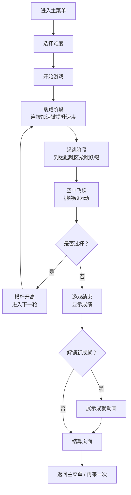

## 1. 产品概述

青少年体育科普跳高小游戏，通过趣味化的游戏方式让青少年了解跳高运动的基本原理和技巧。玩家通过键盘控制助跑速度和起跳时机，越过不断升高的横杆，体验竞技体育的乐趣。

- 主要目的：以游戏化方式科普跳高运动知识，培养青少年对体育运动的兴趣
- 目标用户：10-18岁青少年群体
- 产品价值：寓教于乐，在游戏中学习体育知识，锻炼反应能力和节奏感

## 2. 核心功能

### 2.1 功能模块

1. **主菜单页面**：游戏标题、开始按钮、难度选择、成就入口、分数记录
2. **游戏主场景**：运动员角色、助跑道、横杆、高度显示、操作提示
3. **结算页面**：本次成绩、历史最高分、成就解锁提示、重新开始
4. **成就系统**：多个成就项、解锁进度展示、成就奖励

### 2.2 页面详情

| 页面名称 | 模块名称 | 功能描述 |
|----------|----------|----------|
| 主菜单页面 | 标题区域 | 游戏大标题、副标题、动态装饰元素 |
| 主菜单页面 | 难度选择 | 简单/普通/困难三档难度，影响横杆升高速度和初始高度 |
| 主菜单页面 | 功能按钮 | 开始游戏、查看成就、查看历史记录 |
| 游戏主场景 | 角色系统 | 运动员助跑动画、起跳动画、过杆动画、落地动画 |
| 游戏主场景 | 物理系统 | 真实重力模拟、速度与跳跃高度计算、碰撞检测 |
| 游戏主场景 | 横杆系统 | 横杆高度逐步提升、碰杆判定、横杆掉落动画 |
| 游戏主场景 | 操作提示 | 键盘/触控操作指引、力度条显示、时机提示 |
| 游戏主场景 | HUD界面 | 当前高度、得分、关卡进度、暂停按钮 |
| 结算页面 | 成绩展示 | 本次跳高高度、得分、是否破纪录 |
| 结算页面 | 成就提示 | 新解锁成就展示、成就图标动画 |
| 结算页面 | 操作按钮 | 再来一次、返回主菜单、分享成绩 |
| 成就页面 | 成就列表 | 所有成就项、解锁状态、成就描述、奖励 |
| 成就页面 | 进度统计 | 总成就数、已解锁数、完成百分比 |

## 3. 核心流程

玩家进入游戏主菜单，选择难度后开始游戏。角色自动进入助跑阶段，玩家通过按键控制助跑速度（快速连按加速），在起跳线附近按下跳跃键起跳，角色在空中划出抛物线越过横杆。成功过杆后横杆升高，进入下一轮；失败则游戏结束，显示成绩和成就。

## 4. 用户界面设计

### 4.1 设计风格

- **主色调**：天空蓝 (#4FC3F7) 作为主色，象征运动与活力；草地绿 (#81C784) 作为辅助色，模拟运动场环境
- **强调色**：橙红色 (#FF7043) 用于按钮和重要提示，醒目且充满活力
- **背景色**：渐变天空蓝到浅蓝，营造开阔的运动场景
- **按钮风格**：圆润大按钮，带有轻微3D效果和阴影，悬停时有缩放和颜色变化
- **字体**：使用圆润可爱的无衬线字体，标题字号大且醒目，正文字号适中易读
- **布局风格**：卡片式布局，元素间距宽松，适合青少年审美
- **图标风格**：扁平化卡通风格图标，色彩明快，线条简洁

### 4.2 页面设计概述

| 页面名称 | 模块名称 | UI元素 |
|----------|----------|--------|
| 主菜单页面 | 标题区域 | 大标题带跳转动画、副标题、运动装饰图案 |
| 主菜单页面 | 难度选择 | 三个卡片式选项，选中状态高亮，带难度图标 |
| 主菜单页面 | 功能按钮 | 大按钮带图标，悬停缩放效果 |
| 游戏主场景 | 场景背景 | 渐变天空、云朵动画、远处建筑剪影、草地跑道 |
| 游戏主场景 | 角色动画 | 卡通风格运动员，多帧跑步/跳跃/落地动画 |
| 游戏主场景 | 横杆立柱 | 左右立柱带刻度标记，横杆有弹性效果 |
| 游戏主场景 | HUD界面 | 顶部半透明信息栏，显示高度和分数 |
| 游戏主场景 | 力度条 | 底部动态蓄力条，颜色从绿到红渐变 |
| 结算页面 | 成绩卡片 | 圆角卡片，大数字显示成绩，破纪录特效 |
| 结算页面 | 成就提示 | 成就图标从下往上滑入，带光芒特效 |
| 成就页面 | 成就网格 | 网格布局，已解锁彩色图标，未解锁灰色锁图标 |

### 4.3 响应式

- **桌面优先**：以桌面端为主要设计基准，画面尺寸 960x600
- **移动适配**：支持屏幕缩放，自动适配不同设备尺寸
- **触控优化**：移动端提供虚拟按键区域，增大触控目标，支持多指操作
- **横竖屏**：游戏以横屏体验为主，移动端建议横屏游玩

### 4.4 游戏体验要点

- **操作手感**：助跑加速有节奏感，起跳反馈清晰，物理效果流畅自然
- **难度曲线**：初始高度较低，逐步提升难度，给玩家成长空间
- **反馈机制**：成功时有欢呼音效和特效，失败时有鼓励性提示
- **成就激励**：设置多个层次的成就目标，持续激发玩家挑战欲
- **科普元素**：游戏中穿插跳高小知识，如背越式、俯卧式等技巧介绍
