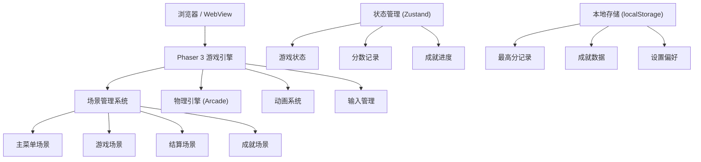

## 1. 架构设计



## 2. 技术描述

- **前端框架**：React 18 + TypeScript + Vite
- **游戏引擎**：Phaser 3.x
- **物理引擎**：Phaser Arcade Physics（2D物理，适合跳高游戏）
- **状态管理**：Zustand
- **样式方案**：Tailwind CSS 3
- **数据持久化**：localStorage
- **动画**：Phaser Tween + 帧动画 + CSS动画

### 技术选型理由

1. **Phaser 3**：成熟的HTML5游戏引擎，内置物理引擎、动画系统、输入管理，适合快速开发2D游戏
2. **Arcade Physics**：轻量级2D物理引擎，足够支撑跳高游戏的重力、速度、碰撞等物理效果，性能优秀
3. **React + Zustand**：用于管理UI层状态和游戏全局状态，与Phaser场景解耦
4. **Tailwind CSS**：快速构建响应式UI界面
5. **localStorage**：本地存储分数和成就数据，无需后端服务

## 3. 游戏场景定义

| 场景名称 | 场景键名 | 主要职责 |
|----------|----------|----------|
| 主菜单场景 | MenuScene | 显示标题、难度选择、开始按钮、成就入口 |
| 游戏场景 | GameScene | 核心游戏逻辑：助跑、起跳、物理、碰撞、计分 |
| 结算场景 | ResultScene | 显示本次成绩、历史最高、成就解锁 |
| 成就场景 | AchievementScene | 展示所有成就及解锁状态 |

## 4. 核心类/模块定义

### 4.1 游戏状态类型

```typescript
interface GameState {
  // 游戏状态
  status: 'menu' | 'playing' | 'paused' | 'gameover';
  difficulty: 'easy' | 'normal' | 'hard';
  
  // 玩家状态
  player: {
    x: number;
    y: number;
    velocityX: number;
    velocityY: number;
    isRunning: boolean;
    isJumping: boolean;
    runSpeed: number;
  };
  
  // 横杆状态
  bar: {
    height: number;
    isFailed: boolean;
  };
  
  // 分数
  score: number;
  highScore: number;
  currentHeight: number;
  
  // 成就
  achievements: Achievement[];
}

interface Achievement {
  id: string;
  name: string;
  description: string;
  icon: string;
  unlocked: boolean;
  unlockedAt?: number;
  condition: {
    type: 'height' | 'score' | 'combo' | 'special';
    value: number;
  };
}
```

### 4.2 物理参数

| 参数名 | 简单 | 普通 | 困难 | 说明 |
|--------|------|------|------|------|
| 初始高度 | 1.0m | 1.2m | 1.5m | 起始横杆高度 |
| 升高步长 | 0.05m | 0.08m | 0.1m | 每次成功后的升高量 |
| 重力加速度 | 800 | 900 | 1000 | 像素/秒² |
| 最大助跑速度 | 300 | 350 | 400 | 像素/秒 |
| 跳跃力度系数 | 1.0 | 1.0 | 0.95 | 影响跳跃高度 |
| 助跑距离 | 400px | 350px | 300px | 起跳线到起点的距离 |

## 5. 数据模型

### 5.1 存储数据结构

```typescript
// localStorage key: 'highJumpGameData'
interface GameStorageData {
  highScores: {
    easy: number;
    normal: number;
    hard: number;
  };
  achievements: {
    [id: string]: {
      unlocked: boolean;
      unlockedAt: number;
    };
  };
  settings: {
    soundEnabled: boolean;
    musicEnabled: boolean;
    difficulty: 'easy' | 'normal' | 'hard';
  };
  totalJumps: number;
  totalPlayTime: number;
}
```

### 5.2 成就列表

| 成就ID | 成就名称 | 条件 | 说明 |
|--------|----------|------|------|
| first_jump | 初次飞跃 | 完成第一次跳跃 | 完成首次尝试 |
| height_150 | 一米五 | 跳过1.5米高度 | 初级挑战 |
| height_180 | 一米八 | 跳过1.8米高度 | 中级挑战 |
| height_200 | 两米大关 | 跳过2.0米高度 | 高级挑战 |
| height_220 | 飞越巅峰 | 跳过2.2米高度 | 终极挑战 |
| combo_5 | 五连跳 | 连续成功5次 | 连续成功 |
| combo_10 | 十全十美 | 连续成功10次 | 连续成功 |
| perfect_timing | 完美时机 | 在最佳时机起跳 | 时机掌握 |
| speed_demon | 风驰电掣 | 达到最大助跑速度 | 速度挑战 |
| all_difficulties | 全能选手 | 在所有难度下都跳过1.5米 | 全面挑战 |

## 6. 目录结构

```
src/
├── components/          # React UI组件
│   ├── MenuOverlay.tsx     # 主菜单覆盖层
│   ├── HUD.tsx             # 游戏HUD
│   ├── ResultPanel.tsx     # 结算面板
│   ├── AchievementPanel.tsx # 成就面板
│   └── TouchControls.tsx   # 触控按键
├── game/                # Phaser游戏相关
│   ├── scenes/            # 游戏场景
│   │   ├── MenuScene.ts
│   │   ├── GameScene.ts
│   │   ├── ResultScene.ts
│   │   └── AchievementScene.ts
│   ├── objects/           # 游戏对象
│   │   ├── Player.ts         # 玩家角色
│   │   ├── Bar.ts            # 横杆
│   │   └── Track.ts          # 跑道
│   └── utils/             # 游戏工具函数
│       ├── physics.ts        # 物理计算
│       └── constants.ts      # 游戏常量
├── store/               # 状态管理
│   └── useGameStore.ts
├── hooks/               # 自定义Hooks
│   ├── useGameLoop.ts
│   └── useAchievements.ts
├── utils/               # 工具函数
│   ├── storage.ts
│   └── achievements.ts
├── App.tsx
└── main.tsx
```

## 7. 输入控制

### 7.1 键盘控制

| 按键 | 功能 | 说明 |
|------|------|------|
| 空格键 / ↑ | 跳跃 | 在起跳区按下起跳 |
| → / D | 加速 | 连按提升助跑速度 |
| 空格键（菜单） | 确认 | 菜单中确认选择 |
| ESC | 暂停/返回 | 游戏中暂停，菜单中返回 |

### 7.2 触控控制

- 屏幕左半部分：连按加速区
- 屏幕右半部分：跳跃按钮
- 支持多点触控：可同时按住加速并点击跳跃
